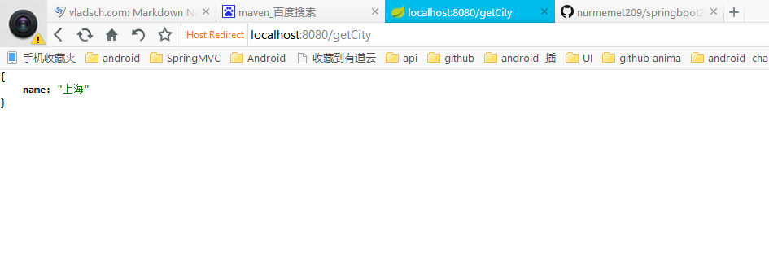

# SpringBoot中使用fastjson
* 首先在http://mvnrepository.com/ 中搜索fastjson找到最新版本  
* gradle.build文件添加
```groovy
// https://mvnrepository.com/artifact/com.alibaba/fastjson
compile group: 'com.alibaba', name: 'fastjson', version: '1.2.23'
```
* 修改启动类SampleSpplication 添加Bean,修改完后SampleApplication.java
```java
package com.cn.app;

import com.alibaba.fastjson.serializer.SerializerFeature;
import com.alibaba.fastjson.support.config.FastJsonConfig;
import com.alibaba.fastjson.support.spring.FastJsonHttpMessageConverter;
import org.springframework.boot.SpringApplication;
import org.springframework.boot.autoconfigure.SpringBootApplication;
import org.springframework.boot.autoconfigure.web.HttpMessageConverters;
import org.springframework.boot.builder.SpringApplicationBuilder;
import org.springframework.boot.web.support.SpringBootServletInitializer;
import org.springframework.context.annotation.Bean;
import org.springframework.http.converter.HttpMessageConverter;

/**
 * Created by Administrator on 1/17/2017.
 */

@SpringBootApplication(scanBasePackages = "com.cn")
public class SampleApplication extends SpringBootServletInitializer {


    @Bean
    public HttpMessageConverters fastJsonHttpMessageConverters() {
        FastJsonHttpMessageConverter fastConverter = new FastJsonHttpMessageConverter();
        FastJsonConfig fastJsonConfig = new FastJsonConfig();
        fastJsonConfig.setSerializerFeatures(SerializerFeature.PrettyFormat);
        fastConverter.setFastJsonConfig(fastJsonConfig);
        HttpMessageConverter<?> converter = fastConverter;
        return new HttpMessageConverters(converter);
    }
    @Override
    protected SpringApplicationBuilder configure(SpringApplicationBuilder application) {
        return application.sources(SampleApplication.class);
    }


    public static void main(String[] args) {
        SpringApplication.run(SampleApplication.class, args);


    }

}
```

* application.properties文件中配置编码格式
```properties
banner.charset=UTF-8
server.tomcat.uri-encoding=UTF-8
spring.http.encoding.charset=UTF-8
spring.http.encoding.enabled=true
spring.http.encoding.force=true
spring.messages.encoding=UTF-8
```

* 验证结果
```java
package com.cn.bean;

import com.alibaba.fastjson.annotation.JSONField;

/**
 * Created by Administrator on 1/21/2017.
 */
public class City {

    private String name;
    @JSONField(serialize=false)
    private String cityCode;

    public String getName() {
        return name;
    }

    public void setName(String name) {
        this.name = name;
    }

    public String getCityCode() {
        return cityCode;
    }

    public void setCityCode(String cityCode) {
        this.cityCode = cityCode;
    }


}

```
```java
package com.cn.controller;

import com.cn.bean.City;
import org.springframework.stereotype.Controller;
import org.springframework.web.bind.annotation.GetMapping;
import org.springframework.web.bind.annotation.ResponseBody;

import java.util.Map;

/**
 * Created by Administrator on 1/18/2017.
 */
@Controller
public class MyController {

    @GetMapping("/index")
    public String index(Map<String, Object> model) {
        model.put("msg", "welocme");
        return "index";
    }

    @GetMapping("/getCity")
    @ResponseBody
    public City getCity() {
        City city = new City();
        city.setName("上海");
        city.setCityCode("0212");
        return city;
    }
}

```
运行结果如下
